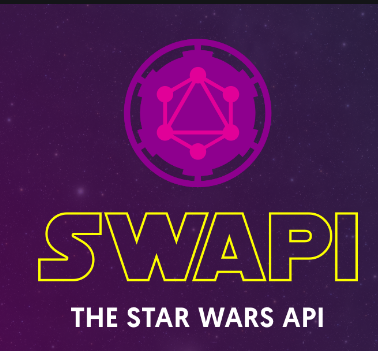

# Desafio StarWars

Trata-se de uma API que integra com o serviço público **[SWAPI][swapi]** para complementar informações a respeito dos planetas de StarWars.

A aplicação desenvolvida utiliza Flask como framework web e MongoDB como banco de dados para o armazenamento de informações pertinentes aos planetas. Ambas as tecnologias estão containerizadas.

<p align="center">
  
</p>

---

## Como rodar?

Primeiramente deve clonar o repositório em seu computador:

```
https://github.com/adornodev/desafio-bit-starwars.git
```

Com o repositório clonado, na raiz principal do projeto há um arquivo chamado _requirements_txt_. Nele consta todas as dependências necessárias para a execução do projeto.

Para instalar as dependências, no mesmo diretório que encontra este arquivo, rode o comando:

```shell
pip install -r requirements_txt
```

Após a instalação dos packages, para iniciar a aplicação em conjunto ao banco de dados, execute o comando:

```docker
docker-compose up
```

Para interromper a execução, execute

```docker
docker-compose down
```

---

## Exemplos de uso

[swapi]: https://swapi.co/
